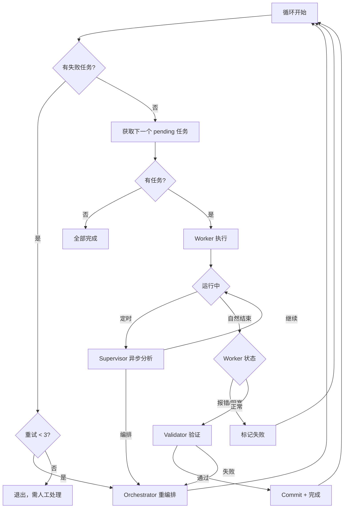

# Claude Long-Running Agent

一个 Claude Code 的上层任务编排框架，用于可控地执行复杂的长期项目。

## 为什么需要这个？

~~Just for fun~~

Claude Code 是一个自由度很高的辅助编程工具，但在处理复杂项目时存在一些挑战：

| 问题 | 本项目的解决方案 |
|------|------------------|
| **上下文爆炸** | 拆分为小任务，每个任务独立会话 |
| **注意力缺失** | 单任务专注，避免因任务过多而简化执行 |
| **关键步骤遗漏** | 强制执行 Workflow（测试、Git Commit） |

## 核心思想

```
一个任务 = 一次 Claude 会话
```

将复杂项目拆分为多个小任务，每个任务在单次会话（10-15分钟）内完成。

## 架构

```
┌───────────────────────────────────────────────────────┐
│                       main.py                         │
│                   LongRunningAgent                    │
├───────────────────────────────────────────────────────┤
│  TaskManager  Supervisor  Worker  Validator  CostTracker │
│                          ↓                            │
│                     Orchestrator                      │
├───────────────────────────────────────────────────────┤
│                     workspace/                        │
│          your codes + tasks.json + CLAUDE.md          │
└───────────────────────────────────────────────────────┘
```

**模块职责：**
| 模块 | 功能 |
|------|------|
| `TaskManager` | 任务状态管理（加载/保存/状态转换） |
| `Worker` | 封装 Claude CLI 执行任务，输出日志解析 |
| `Supervisor` | 定期检查 Worker 进度，判断是否需要干预 |
| `Validator` | 任务完成后检查代码、运行测试、自动 commit |
| `Orchestrator` | 任务失败超限时重新编排 tasks.json |
| `CostTracker` | 统一追踪所有组件的 token 消耗和成本 |

**执行流程：**


## 快速开始

### 1. 初始化并生成任务

```bash
# 初始化 + 自动生成任务（推荐）
python3 main.py -w ~/my-project init "实现一个博客系统，包含文章管理和用户认证"

# 仅初始化（不生成任务）
python3 main.py -w ~/my-project init
```

### 2. 或手动创建任务文件

```json
[
  {
    "id": "001",
    "description": "创建用户数据模型",
    "priority": 1,
    "steps": ["创建 models/user.py", "定义 User 类", "添加序列化方法"]
  },
  {
    "id": "002",
    "description": "实现用户注册功能",
    "priority": 2,
    "steps": ["创建 UserManager 类", "实现 register() 方法", "添加密码加密"]
  }
]
```

### 3. 运行

```bash
# 执行所有任务
python3 main.py -w ~/my-project run

# 执行指定数量
python3 main.py -w ~/my-project run --max-tasks 3

# 查看状态
python3 main.py -w ~/my-project status
```

## 命令参考

| 命令 | 说明 |
|------|------|
| `init [描述]` | 初始化环境；可选提供需求描述，自动生成 tasks.json |
| `run` | 运行任务处理 |
| `status` | 显示当前状态 |
| `add "描述"` | 根据自然语言描述追加任务到现有列表 |
| `reset` | 重置所有任务 |
| `reset-task <id>` | 重置单个任务 |

全局参数：
- `-w/--workspace <path>` 指定工作目录
- `-q/--quiet` 静默模式（不显示 Claude 执行过程）

## 实时输出

默认情况下，系统会显示 Claude 的执行过程：

```
──────────────────────────────────────────────────
📝 处理任务 [001]: 创建 Todo 数据模型
   优先级: 1
──────────────────────────────────────────────────
   [00:00:15] 💭 我来创建 Todo 数据模型...
   [00:00:23] 🔧 Write: models/todo.py
   [00:00:45] 🔧 Edit: models/todo.py
   [00:01:02] ✅ 完成
   💰 成本: $0.0234 | 总成本: $0.0234
```

使用 `-q` 参数可关闭实时输出。

## 成本统计

系统会追踪所有组件的 token 消耗，任务结束后显示完整统计：

```
==================================================
💰 成本统计
==================================================

按来源分类:
   🔨 worker              : $0.4500
   👀 supervisor          : $0.0900
   🎭 orchestrator        : $0.0650
   ✅ validator           : $0.0320

────────────────────────────────────────
   总成本:     $0.6370
==================================================
```

**典型成本参考** (基于 Claude Sonnet):
| 场景 | 估算成本 |
|------|---------|
| 单任务顺利完成 | ~$0.32 |
| 5 个任务的项目 | ~$1.90 |

成本记录保存在 `.claude_plus/cost_history.jsonl`。

## 安全终止 (Ctrl+C)

执行过程中按 **Ctrl+C** 可安全终止：

```
============================================================
⚠️  检测到 Ctrl+C，正在安全终止...
============================================================

正在回退任务 [001] 的未完成更改...
   ✅ 已回退到 commit: a1b2c3d4
   ✅ 已重置任务 [001] 状态

下次可以继续运行: python3 main.py run
```

系统会自动：
1. **回退 Git** - 撤销未完成任务的所有更改
2. **重置任务状态** - 任务变回 `pending`，下次继续执行

### 手动恢复（如果自动回退失败）

```bash
# 查看 commit 历史
git log --oneline -5
git log --graph --pretty=format:"%C(yellow)%h%Creset %C(cyan)%ad%Creset %s %C(auto)%d%Creset" --date=format:"%Y-%m-%d %H:%M:%S" -5

# 回退到指定 commit
git reset --hard <commit-hash>

# 重置任务状态
python3 main.py reset-task <task_id>
```

## 失败处理

任务失败后，系统会在**下一轮循环立即调用 Orchestrator** 处理（最多重试 3 次）：

1. **重试**：将任务状态改回 `pending`
2. **修改后重试**：调整任务描述/步骤后重试
3. **拆分**：将复杂任务拆分为多个小任务
4. **删除**：如果任务不再需要

如果 3 次后仍有未解决的失败任务，系统会打印详情并退出，需要手动处理：
```bash
python3 main.py reset-task 001
python3 main.py run
```

## 安全保护

- **初始快照**：首次初始化时提交所有现有文件
- **Git 追踪**：每个任务完成后自动 commit
- **敏感目录**：禁止使用 `/etc`、`/usr` 等系统目录
- **回滚能力**：出问题可 `git reset --hard` 恢复

## 文件说明

| 文件 | 说明 |
|------|------|
| `tasks.json` | 任务列表（用户创建或 AI 生成） |
| `CLAUDE.md` | 项目上下文说明（用户创建） |
| `.claude_plus/` | 运行时数据（成本记录、日志等） |

## 任务编写规范

详见 [TASKS_GUIDE.md](./TASKS_GUIDE.md)

核心原则：
- **单一职责**：每个任务只做一件事
- **明确边界**：指明文件路径和函数名
- **依赖顺序**：用 priority 控制执行顺序
- **可验证**：steps 应能检验完成情况

## 配置

编辑 `config.py`：

```python
CHECK_INTERVAL = 1500  # Supervisor 检查间隔（秒），默认 25 分钟
```

> Supervisor 会智能判断任务执行状态，不设硬性超时上限。

## 局限性

- 相比原生 Claude Code，自由度有所降低
- 任务拆分粒度需要人工或 AI 预先设计
- 跨任务的复杂状态依赖当前主要靠 Git 和 `task.notes`

## 未来方向

- **交互式需求细化**：从模糊描述出发，对话式讨论并生成任务计划
- **更智能的任务编排**：Orchestrator 自动识别依赖、动态拆分
- **可视化执行面板**：实时查看任务状态、日志、成本
- **插件化 Workflow**：支持自定义验证步骤（Lint、类型检查、集成测试）

---

## 参考与致谢

本项目受 [Anthropic 博客: Effective Harnesses for Long-Running Agents](https://www.anthropic.com/engineering/effective-harnesses-for-long-running-agents) 启发，在此基础上进行了大量改进和扩展。
